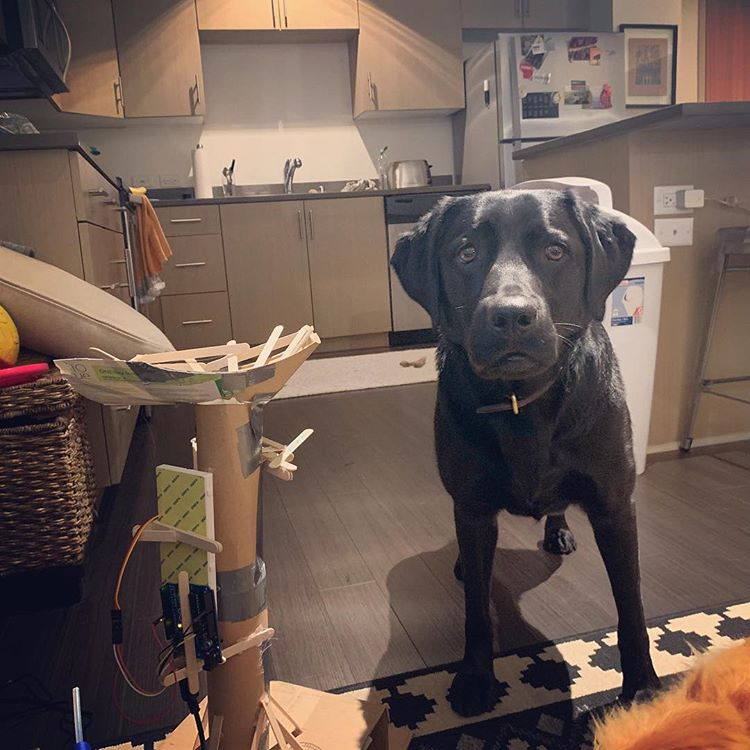
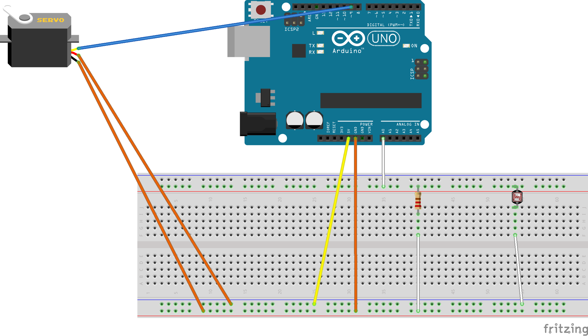

[Click to See video](https://www.instagram.com/p/BpQzOuyHv6P/)

A simple ball fetch machine using an arduino.

1. Dog puts ball in top
2. Ball is stopped in tube.
3. Photoresistor detects ball is in tube.
4. Servo is triggered, allowing ball to continue through tube.
5. Ball is redirected outward.
6. Fetch complete.

